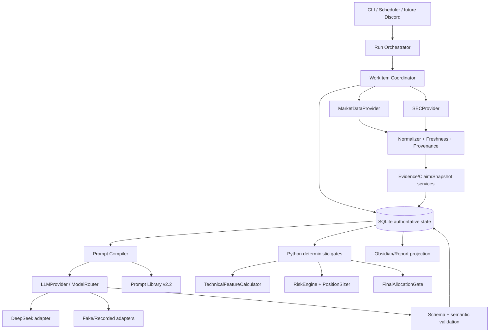

# Target Architecture vNext

## Design decision

Keep the v1.1 single-host Python modular monolith and SQLite WAL, but separate
the current `StockAgent` god coordinator into explicit application services and
provider boundaries. Prompt Library v2.2 remains an LLM reasoning contract;
it does not become the system database or workflow engine.

## Component diagram



## Authority boundaries

| Authority | Owns | Must not own |
|---|---|---|
| Provider adapters | raw external fetch, request provenance, retry classification | gate/action/risk conclusions |
| Normalizer/Evidence service | normalized snapshots, evidence identity, freshness, source rank | investment action |
| Prompt Compiler/LLM | interpretation, claims, scenarios, recommendation proposal | WorkItem state, StageGate, price, sizing, FinalAction |
| Python Gate/Risk services | deterministic features, hard rules, risk arithmetic, semantic checks | prose generation |
| SQLite repository | authoritative state, transactions, CAS, dependencies, outbox | model/vendor-specific behavior |
| Obsidian projection | human-readable durable knowledge/report projection | operational authority/rollback |

## End-to-end target flow

1. `CommandIntent` is authenticated and idempotent.
2. Rule Registry resolves an immutable `EffectiveRuleSet`; source hashes and
   override authority are stored in the Run.
3. WorkItem DAG fetches MarketSnapshot and SEC index/facts through provider
   adapters. Raw artifacts are content-addressed and never replaced in place.
4. Python normalizers create identity/freshness/provenance-bearing snapshots.
5. TechnicalFeatureCalculator creates TechnicalSnapshot; StageClassifier
   proposes a StageAssessment; Python StageGate owns eligibility.
6. Cheap Capital Prescreen runs before expensive research.
7. Deep Research, Full SEC Forensic, and independent Audit invoke v2.2 prompts
   through Prompt Compiler/LLMProvider. Results are advisory and persisted with
   dependency hashes.
8. Python checks all live prerequisites and creates QualifiedCandidatePool.
9. HUNT_ONLY ends there. Execution mode imports fresh portfolio and execution
   market snapshots, computes risk/size, compares alternatives/cash, and calls
   FinalAllocationGate.
10. FinalAction and report/outbox are committed atomically; Obsidian is a
    retryable projection after authoritative commit.

## Run states

```text
CREATED -> RUNNING -> PAUSED -> RUNNING
RUNNING -> RETRY_WAIT -> RUNNING
RUNNING -> MANUAL_REVIEW -> RUNNING
RUNNING -> NO_QUALIFIED_CANDIDATE | PARTIAL_COMPLETION | COMPLETED
RUNNING -> FAILED | CANCELLED
```

`current_stage` is a progress projection only. WorkItem rows and committed
results are recovery authority.

## Database ownership

The vNext schema adds typed tables for SecurityMaster, MarketSnapshot,
SectorSnapshot, IndustryDriverSnapshot, TechnicalSnapshot, StageAssessment,
CapitalStructureSnapshot/Prescreen, PortfolioSnapshot/Position, RiskAssessment,
QualifiedCandidatePool, PromptExecution/ModelCall/ProviderCall,
SubjectDependencyFence, EvidenceConflict, ThesisInvalidation, ReportArtifact,
NotificationOutbox, Checkpoint and ErrorEvent. Existing rows are retained and
migrated expand→backfill→validate→contract; no destructive auto-reset.

## First-touch / delta

`KnowledgeLoader` chooses FIRST_TOUCH when no valid baseline exists; otherwise
it builds a DELTA evidence bundle. Critical stale evidence forces refresh and
changes the dependency fence. The LLM sees the bundle, but SQLite owns the
baseline/version and whether the delta is complete.

## Crash/recovery

Startup validates migration/config/rule hashes and SQLite integrity, reconciles
expired leases and unresolved CostReservations, preserves SUCCEEDED results,
marks late results orphan/stale, and requeues only eligible WorkItems. Provider
calls are at-least-once; durable result commits are idempotent.
